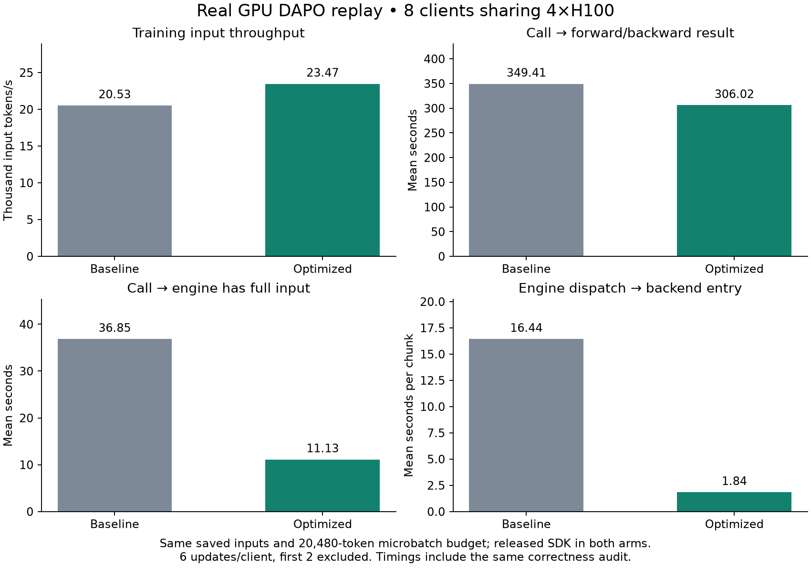
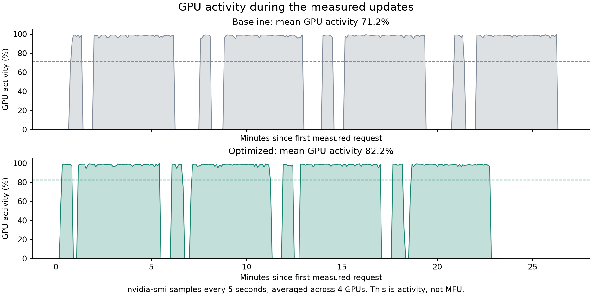
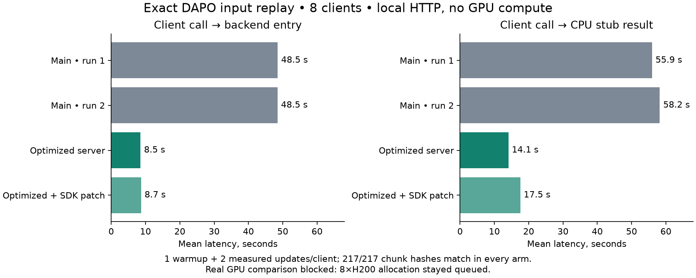

# Training request path: exact DAPO replay

These scripts replay saved inputs from the eight-client Qwen3.5-9B DAPO run of
2026-10-02. They do not generate a substitute dataset. Each client update contains
64 responses. Token IDs, rollout log probabilities, rewards and the original
advantage calculation are preserved. The GPU and CPU codec tests use updates 8–13; the
local HTTP tests use updates 8–10.

## Changes

- Advertise the SDK's existing compressed protobuf upload support. Decode its
  tensor buffers directly, without converting them through JSON/base64.
- Move large request decoding and fingerprint construction off the HTTP event
  loop. Compute fingerprints before taking the engine state lock; admission and
  duplicate checks remain atomic inside that lock.
- Encode validated training arrays once. Reuse those bytes for the retry
  fingerprint and the private engine-to-backend request, replacing the large
  internal JSON encode/parse/validation pass. Preserve received float precision,
  sparse indices, shapes and multimodal input metadata.
- Run independent routing reads concurrently and share pending reads for the
  same model/instance. Share pending session heartbeat writes. Authorization is
  still checked for each request; completed reads are not cached.
- Separately, the included Tinker 0.24.1 patch counts tensor elements without
  allocating a Python list. It preserves the SDK's existing chunk boundaries.
  This patch is not installed by the Spindle changes.

The engine and backend must be updated together: the backend accepts both the
old JSON format and the new binary format, but an old backend cannot accept the
new sender. They run in the same trainer deployment. Public JSON clients remain
supported. No result format, loss function or optimizer behavior changes.

## Correctness

The HTTP benchmark computes SHA-256 over an independent canonical JSON
representation before submission and again at executor entry. It compares the
complete multiset of `(model_id, payload_hash)` pairs, checking for altered,
missing and duplicate chunks. Both GPU arms delivered all **436 chunks from 48 client updates** exactly:
3,072 datums and **49,331,231 input tokens per arm**. Every optimizer update
succeeded with finite metrics. The backend reported the expected token and
sequence counts for each update. The first-update losses matched exactly for
all eight clients. The local HTTP tests also matched all 217 chunks across 24
updates, and the CPU codec replay matched the same 48 updates used on GPU.

244 engine, control-plane, provider and replay tests pass. They include exact
numeric preservation, sparse and multimodal data, JSON/protobuf retry equivalence,
changed-data rejection, compressed-request rejection with sequence advancement,
concurrent routing, closed sessions and cancelled liveness waiters. Two separate
SDK tests verify unchanged chunk-size estimates without tensor-list conversion.

These checks cover data preservation and successful real training. They do not
establish bitwise parameter equivalence: per-model seeds are unsupported by this
Miles backend, CUDA execution was not forced deterministic, and no checkpoints
were saved. Across all updates, the largest absolute loss-sum difference was
0.00002815; this is a diagnostic value, not an asserted numerical tolerance.

## GPU comparison: October 6, 2026



Baseline: commit `7279288e095d7d1b42cd6abb902cbf87ddc6039d`. Optimized:
`633f914`. Both used the released Tinker 0.24.1 SDK; the optional SDK patch was
not applied. Only the eight intended request-path source files differed between
the deployed copies. Both received the same benchmark instrumentation.

Both configurations used Qwen3.5-9B, eight rank-32 clients, one **4×H100 trainer**,
TP1/DP4, 32 CPUs, 256 GiB host memory, 32k context and a **20,480-token microbatch
budget per GPU**. PyTorch compilation was disabled with `TORCH_COMPILE_DISABLE=1` in both
sets of Ray workers. GPU kernels could still compile on first use, and both
used the shared kernel cache. Two warmup updates were excluded. The longest saved input was 16,670 tokens; none were
truncated. Eight-GPU allocations stayed queued, and 32k microbatches exceeded
H100 memory, so both measured runs used this smaller GPU configuration and token
budget. Aborted attempts are excluded.

Client creation was staggered by five seconds and initial submissions by two
seconds. Each client completed six updates. The first two were excluded, leaving
**32 measured client updates and 32,867,945 input tokens per arm**. The baseline
was fully stopped and verified to have zero tasks before optimized clients
started. All test apps were stopped after completion; existing deployments were
not redeployed. Sampling, publication and checkpointing were disabled; saved
rollouts make the training inputs identical.

| Metric | Baseline | Optimized | Change |
| --- | ---: | ---: | ---: |
| Training input tokens/s | 20,526 | 23,469 | +14.3% |
| Mean call → forward/backward result | 349.41 s | 306.02 s | −12.4% |
| Mean call → optimizer result | 385.81 s | 341.02 s | −11.6% |
| Mean call → full input admitted by engine | 36.85 s | 11.13 s | −69.8% |
| Mean call → backend entry, including queue | 82.71 s | 35.86 s | −56.6% |
| Mean internal encode/send/decode per chunk | 16.44 s | 1.84 s | −88.8% |
| Mean result delivery after engine completion | 15.49 s | 19.57 s | +26.4% |
| Mean GPU activity | 71.2% | 82.2% | +10.9 percentage points |

Throughput divides measured input tokens by wall time from the first measured
forward call to the last measured optimizer result: **1,601.32 s versus
1,400.46 s**. It includes client preparation between updates and all request,
training and result overhead during that interval. This is training input TPS;
there is no live inference throughput measurement. P95 forward-result latency
fell from 405.82 s to 350.96 s.

The SDK splits each client batch into HTTP chunks. Internal encode/send/decode
measures dispatch to executor entry for the batch carrying each chunk; chunks
combined into one backend call share that duration. It includes serialization
and parsing, not just network transit. These overlapping per-request durations
must not be summed to obtain total run time. Admission ends when the engine has
accepted every chunk. Result delivery starts at the engine's execution-complete
marker and includes frontend retrieval, transfer, SDK decoding and polling.

Backend forward/backward calls occupied **1,185.58 s versus 1,190.72 s** in the
measured windows, a 0.4% increase. The throughput gain came from reduced time
around those calls. The response tail got longer in this pair; its individual
causes were not separated by this benchmark. It remains an optimization target.

The independent data audit cost **46.80 s versus 44.79 s** in the measured windows
and is included in the results. Lightweight request timing and five-second GPU
sampling were enabled in both. This is one sequential A/B pair on separate Modal
allocations; the size of the improvement may differ on other workloads.



GPU activity is the five-second `nvidia-smi` utilization reading averaged across
four GPUs. It shows shorter idle gaps with the optimized path. MFU was not
measured.

## Local HTTP measurement boundaries

`http_replay.py` runs the real SDK, frontend, engine and backend as separate local
HTTP processes. Eight clients run concurrently; arms run sequentially and each
arm's processes are terminated before the next starts. One update per client is
excluded as warmup, leaving 16 measured calls per arm.

- **Backend arrival**: immediately before the backend audit hashes its inputs,
  measured from the client calling `forward_backward()`.
- **Forward result**: until the client receives the executor result. This includes
  the audit and SDK result polling.
- The executor is a CPU stub returning small synthetic results. There is no GPU
  computation, realistic per-token result payload, Modal network or remote KV
  latency in these measurements. They cannot establish training TPS.
- `cpu_replay.py` isolates encoding/decoding on CPU, excluding HTTP, queues,
  routing, GPU execution, result delivery and SDK chunk sizing. It encodes a full
  client batch rather than SDK-sized chunks.

## Local HTTP results (seconds)



| Code / SDK | Mean backend arrival | Mean forward result |
| --- | ---: | ---: |
| Main + released SDK, run 1 | 48.52 | 55.94 |
| Main + released SDK, run 2 | 48.46 | 58.19 |
| Optimized server + released SDK | 8.54 | 14.08 |
| Optimized server + sizing patch | 8.70 | 17.55 |

The server changes cut mean backend-arrival latency by about **82%** in this
local replay. The SDK patch has no demonstrated incremental latency benefit in
these runs; asynchronous batching and result polling add variability. Two earlier
optimized runs, before the final vectorized protobuf decoder, measured 8.84–9.12 s
backend arrival and 15.00–16.97 s forward-result latency. All arms matched their
expected data hashes.

The preliminary CPU-only codec replay reduced mean encode/decode work per full
client batch from 6.72 s to 0.95 s. Mean upload size fell from 41.1 MB JSON to
5.49 MB compressed protobuf; internal payload size fell from 45.2 MB JSON to
32.9 MB binary. These are decimal MB and are distinct from the HTTP measurements.

## Reproduce

Use an environment with Spindle's test dependencies and Tinker 0.24.1. Set
`ARCHIVE` to the saved run's `training` directory. Keep result files outside the
repository. Do not run timed arms simultaneously.

```bash
PYTHONPATH=src:. python benchmarks/training_request_path/http_replay.py \
  --archive "$ARCHIVE" --output /tmp/request-path-after
python benchmarks/training_request_path/summarize.py \
  --clients /tmp/request-path-after/clients \
  --backend /tmp/request-path-after/backend.log \
  --output /tmp/request-path-after-summary.json
```

For the baseline, use Spindle commit
`7279288e095d7d1b42cd6abb902cbf87ddc6039d` on `PYTHONPATH` with the same harness and
stock SDK. For the optional SDK improvement, apply
`sdk/tinker-0.24.1-sizing.patch` to Tinker commit
`b9dbbef6f9967cb7d6666fb1b79a2dba12604c5e` and put that source on `PYTHONPATH` too.

`prepare.py before|after DESTINATION` creates isolated deployment source copies
with equal CPU allocation, broad US trainer placement, compilation disabled in
Ray workers, and the same executor audit. `deployment.py` describes the GPU
configuration; change the test deployment names and storage names for a new run.
Deployment is explicit, never performed by the replay scripts. For a GPU run,
use `replay.py --archive "$ARCHIVE" --base-url URL --output OUTPUT` (six updates)
and summarize with `--warmup 2`. The current GPU recipe uses four H100s and a
20,480-token microbatch budget; all saved sequences fit without truncation. Pass
`--startup-stagger 5 --submission-stagger 2` for the matched GPU comparison.
Stop the first arm completely before starting the second. Stop all isolated apps afterwards, including on client failure.
