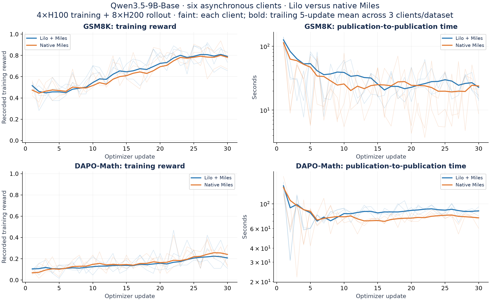
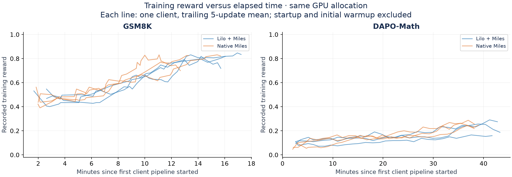
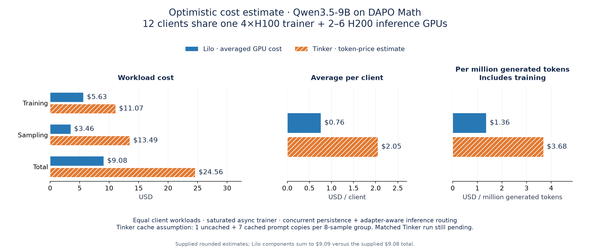
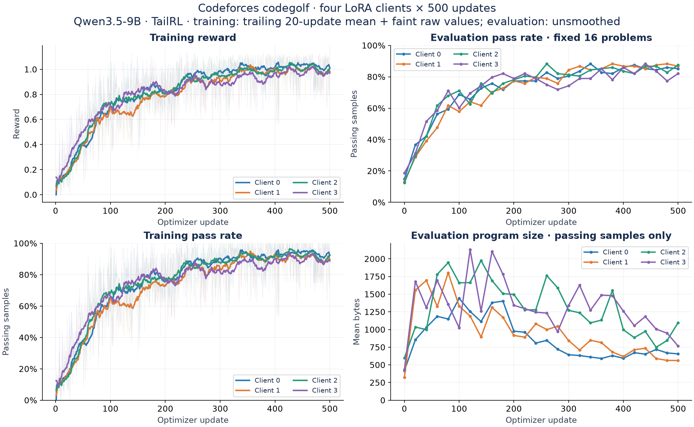
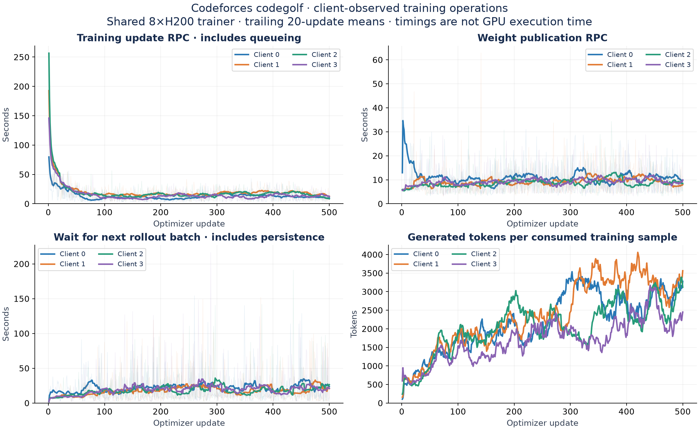
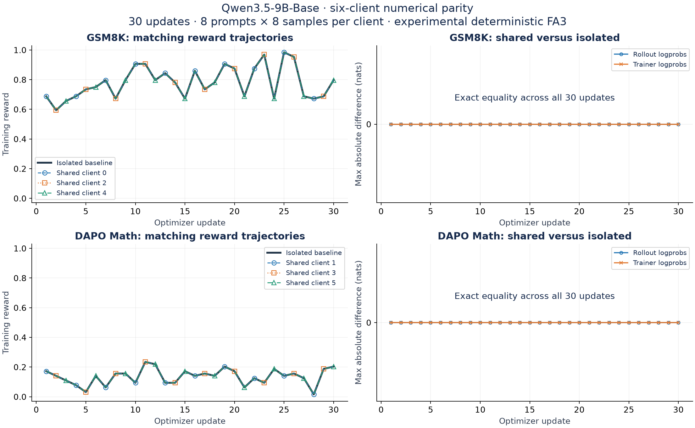
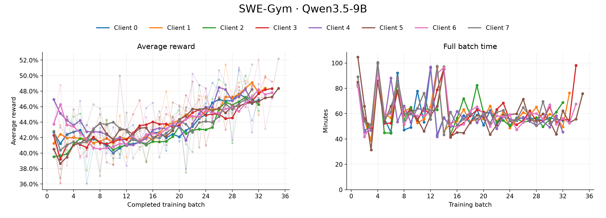
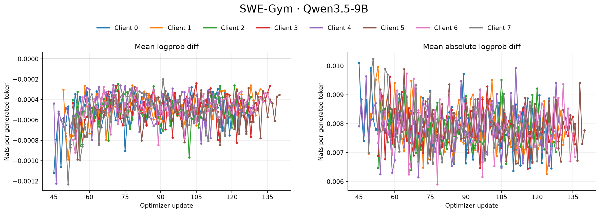
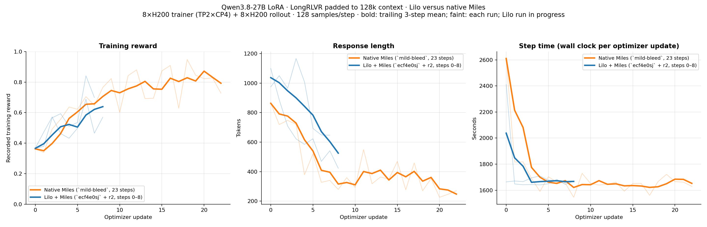

# LoRA validation

Our primary validation so far has been multi-lora async RL with Spindle's Miles backend on gsm8k, dapo math, as well as a longer codeforces codegolf run. 

(Note in all the plots step 0 typically incurs cold-start/compilation times). 

## GSM8K and DAPO Math: Qwen3.5-9B-Base

### Async RL: Spindle versus Miles

Both runs complete 30 updates for each of six clients on one 4×H100 TP4 trainer
and eight H200 inference workers. GSm8k clients use rank 16 + 4k generation cap, dapo uses rank 32 + 8k. Batch size is 8 groups x 8 samples per group. For the native Miles case, we use their Tinker gateway and a fixed rollout pool on Modal. 




| Metric | Spindle | Native Miles |
| --- | ---: | ---: |
| GSM8K median step | 21.95 s | 17.65 s |
| DAPO median step | 84.28 s | 74.81 s |
| GSM8K mean training reward | 0.659 | 0.642 |
| DAPO mean training reward | 0.156 | 0.169 |
| Training interval | 43.27 min | 38.98 min |

The "step time" here for async RL is the time from one weight publication to the next (which incorporates rollout buffer fill, forward_backward, and optim-step time in between). 

same plots vs wall clock time: 



## DAPO Math: Qwen3.5-9B cost estimate

As part of our initial cost validation vs Tinker, we were interested in seeing what the price differential could be 

12 clients sharing one 4×H100 trainer and 2–6 H200 inference GPUs. Optimistic
Spindle GPU-cost accounting versus projected Tinker token charges; the Tinker bill
has not been measured on this workload.



We have a more comprehensive discussion of pricing differences (as well as more analysis into how this difference scales with multi-tenancy) in [workload tuning and memory budgeting](multi-lora.md#how-to-optimize-spindle-workloads-for-token-pricing).

## Codeforces codegolf: Qwen3.5-9B

Four rank-32 clients, 500 updates each, sharing an 8×H200 TP8 trainer and 4–8 H200
inference workers. We used async TailRL for this example, with 64k context and 16k generation cap per turn. This is analogous to a similar experiment we did on the FFT side, with the full details available in `examples/codeforces-codegolf`



Client-observed training, publication, and rollout timings:



### Deterministic Training

One experimental path we've been working on is having multi-tenant runs be fully deterministic. On the inference side, this reduces to the existing batch-invariant implementations that SGlang already has, but on the training side, this means that the forward_backward and optimizer step passes are completely batch-invariant as well such that a client's forward_backward executes with the exact same numerical results no matter how its batches are scheduled through multi-tenant heterogeneous trainer batches. We are able to show preliminary results of deterministic training runs where results are bitwise-identical with single-tenant LoRA on gsm8k + dapo-math: 



The main source of trainer non-determinism was in the fa3 backwards kernel, as well as ensuring ordered gradient accumulation with multiple clients' packed microbatches. 

## SWE-Gym: Qwen3.5-9B

As a longer validation run for agentic RL, we run 8 r32 lora clients with async multi-turn RL on a subset of SWE-gym with 128k context, sharing a single 
8-h200 trainer and eight h200 inference replicas. Batch size 32 groups x 8 per group



Logprob diff: 



## LongRLVR at 128k context: Qwen3.8-27B (2026-09-18)

Qwen3.8-27B LoRA r32 on LongRLVR-Data, generation cap 4k, GRPO 16 groups × 8
samples, lr 1e-4, PPO clip 0.8/1.28, no KL. Both runs use an 8×H200 trainer and
8 H200 rollout GPUs; Spindle runs the trainer as TP2×CP4 and the rollout pool as
4×TP2 SGLang workers.



- Context parallelism (CP4) is what makes the 128k prompt fit on a single
  8-GPU trainer. Miles does not support context parallelism on the Tinker /
  multi-LoRA loss path, so the sequence-sharded loss and the all-gather around
  cross entropy are implemented in Spindle's Miles backend and are being upstreamed
  (radixark/miles#3284). The native Miles run in the plot therefore trains the
  same prompts without CP.
- Step time is at parity: 1676 s median for Spindle versus 1658 s for native Miles.
- Reward tracks the same trajectory over the measured steps (mean 0.56 versus
  0.57 over steps 0–8).
- Spindle's responses stay longer than Miles' over the same window. This is
  related to a loss-weighting delta between Spindle and Miles, which we are
  actively looking into.

The Spindle curve covers the steps completed at the time of writing; the native
Miles curve is the full run.

## DPO on HHH: Qwen3.5-9B-Base (2026-10-02)

DPO runs on the stock `qwen35-9b-lora-16k` deployment with no extra config. The
tinker-cookbook DPO recipe uses `forward_backward_custom` (a `forward` followed by
`cross_entropy` with per-token weights) and gets reference logprobs from
`compute_logprobs` on a sampler published from the step-0 weights. The run uses
the cookbook README settings (HHH, rank 32, β 0.1, batch 256 pairs, linear LR
decay) with lr 1e-4 for 10 steps:

```bash
uv run scripts/e2e_dpo_qwen3_5_9b_lora.py --steps 10 --learning-rate 1e-4 \
  --wandb-project spindle-dpo-validation
```

| Metric | Step 0 | Step 9 |
| --- | --- | --- |
| dpo_loss | 0.6939 | 0.6795 |
| accuracy | 0.480 | 0.557 |
| margin | −0.0011 | 0.0502 |
| chosen reward | −0.0001 | 0.0855 |
| rejected reward | 0.0011 | 0.0353 |

- Margin and accuracy rise over the run, with chosen rewards pulling away from
  rejected ones.
- A warm step takes about 21 s, plus 9–14 s to compute reference logprobs on
  the sampler pool.
- [W&B run](https://wandb.ai/modal-labs/spindle-dpo-validation/runs/0z0obns5).
