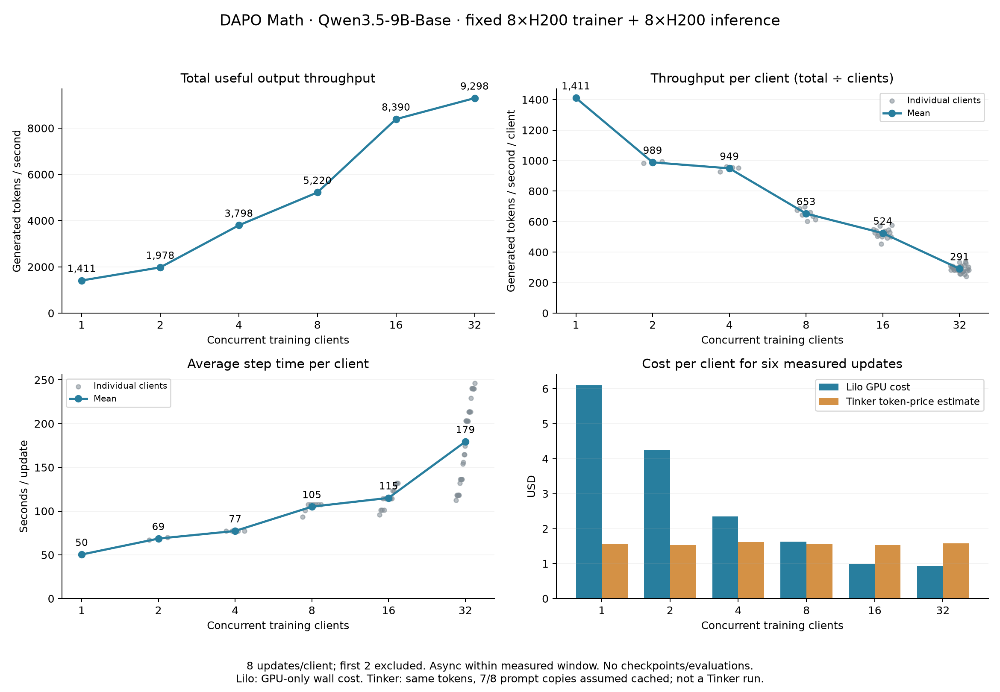
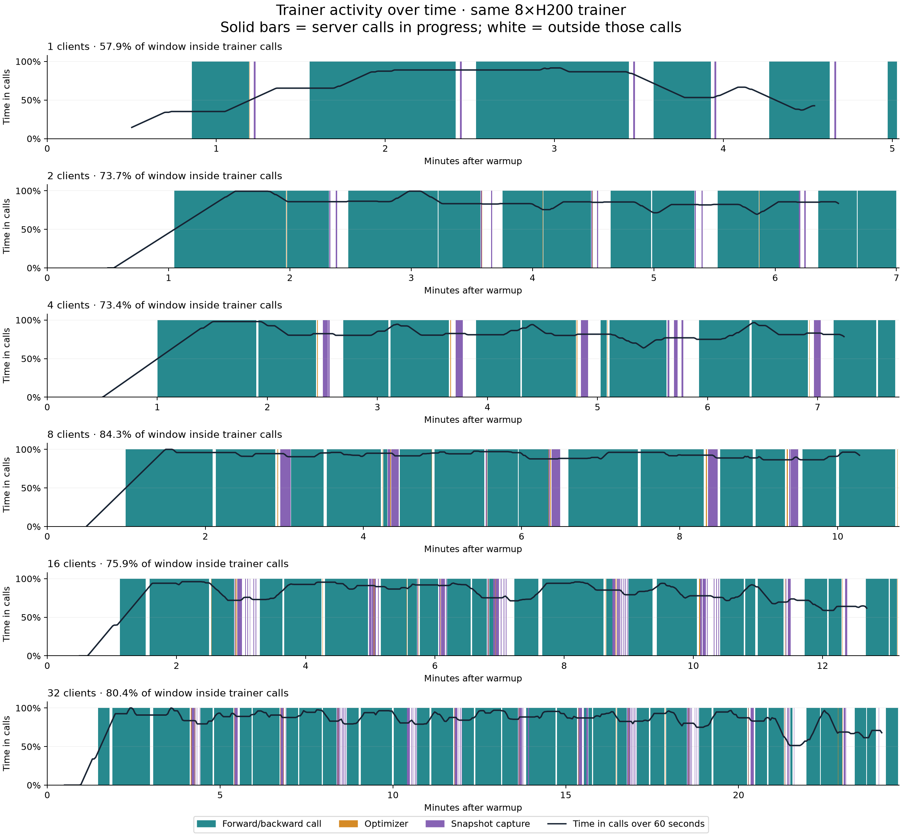

# Working with Multi-LoRA

Our multi-tenant Miles backend runs several LoRA adapters on a shared base model. Each Tinker
training client has its own adapter, gradients, and optimizer state. On the inference side, we adapt the [stitch](https://github.com/modal-projects/stitch) protocol to have multi-lora inference replicas. 

This doc assumes you've gone through the [README](README.md) and understand how to deploy the Tinker server and configure Tinker scripts to hit the server via TINKER_BASE_URL and TINKER_API_KEY, as well as the [Spindle design doc](design.md) to understand what terms such as "training engine" and "rollout pool" mean. 

## Creating clients

For creating multi-lora clients, use the base Tinker `create_lora_training_client` method: 

```python
import tinker

service = tinker.ServiceClient()  # TINKER_BASE_URL and TINKER_API_KEY
clients = [
    service.create_lora_training_client(
        base_model="Qwen/Qwen3.5-9B-Base", rank=16,
    )
    for _ in range(6)
]
```

Clients using the same definition may share an engine depending on available slots/deployment limits. With our Multi-lora backend, clients can use different ranks, up to 32. The LoRA alpha and target modules are set by the deployment (SDK defaults are `train_attn`, `train_mlp`, and `train_unembed` to be true). 

From the perspective of the Tinker client, the usage of multi-lora engines is completely identical to Tinker. Below, we detail some considerations for extracting maximum performance from our multi-lora system. 

## Submit training work

When multiple clients hit the same training engine, the engine will try and batch these clients' requests when possible. The intended use of multi-tenancy to maximize trainer utilization is thus to maintain a steady stream of incoming forward_backward data. The engine's current scheduling logic will interleave client batches when large enough, and multi-lora batch when multiple can fit within a single forward pass. The batching is done wrt "compatibility": in particular, fb requests which share the same `loss_fn` and `loss_fn_config`. This includes consecutive compatible requests from one client (see deterministic training section for ensuring gradient accumulation order). 

The EngineServer's packing of ready batches scans all clients whose forward_backward requests are queued, and packs work up till a max token budget set by the compute configuration. The current greedily scheduler does not account for fairness across clients, so given large-enough client batches, the scheduler will effectively take one-client per engine forward_backward (which reduces to multi-tenant interleaving), whereas with small batches, we are still able to saturate trainer with packing multiple client batches into a single forward-backward (which is the multi-lora batching benefit). 

Miles then packs the combined batch into microbatches using the deployment's token
budget. Scheduling order depends on the queued operations, so clients can
experience different wait times (WIP to figure out a better fair scheduler across clients). 

```python
import asyncio
from tinker import types

adam = types.AdamParams(learning_rate=1e-5)

async def update(client, batch):
    forward = await client.forward_backward_async(
        batch, loss_fn="importance_sampling",
    )
    optimizer = await client.optim_step_async(adam)
    result = await forward.result_async()
    await optimizer.result_async()
    return result

results = await asyncio.gather(*(
    update(client, batch)
    for client, batch in zip(clients, batches, strict=True)
))
```

## Adapter publication via the Bulletin

Unlike the FFT case, sampler publication is done with full-weights adapters, such that using the same rollout pool for both monotonic min-weight versioning and exact versioning is cheap. The entire rollout pool supports arbitrary weight-version sampling, using SGLang's LRU-based eviction mechanism per container. The amount of concurrent LoRAs cached in-container CPU and on GPU can be tuned via `ROLLOUT_MAX_LOADED_LORAS` (which corresponds to sglang's `--max-loaded-loras`) and `ROLLOUT_MAX_LORAS_PER_BATCH` (which corresponds to sglang's `--max-loras-per-batch`) respectively. 

When prefetching rollouts, set a maximum policy lag in your controller and retain
the returned sampling logprobs. The backend accepts batches generated by older
policies. Results can vary with batch packing, request scheduling, and the
policy version served, even when sampling seeds match.

### Publication and persistence scheduling

Our backend schedules checkpoint/publication work such that these operations are split into "capture" and "persist" phases. The capture-phase is GPU-dependent and offloads adapter weights from GPU to CPU. Then, persistence writes the CPU weights to disk/remote volume and is fully asynchronous. Each adapter can have one publication in flight at a time. HOwever, a single multi-lora engine comes with N parallel persistence worker threads, such that multiple clients can have their adapters written to the stitch bulletin at the same time (there will still be shared resource contention for volume committing). 

## How to optimize Spindle workloads for token pricing

Because the pricing model for Modal is fundamentally different from Tinker (compute-based vs token-based), optimizing per-token pricing on Spindle necessarily requires thinking about infrastructure details, something that goes *against* the Tinker contract. With a fixed GPU allocation, higher useful tokens per second lowers GPU cost per token, and thus configs that optimize for TPS directly correlate with lower per-token costs. approximately, 
```text
output TPS = total generated tokens used by completed updates / elapsed seconds
GPU $ per output token = GPU$ per second / output TPS
```
In this section we detail some considerations when implementing multi-lora experiments to maximize output TPS: 

### Keep clients asynchronous and measure the tradeoff

Because trainer is continuously polling for incoming forward_backward data, the best training pattern is to have async RL clients that produce a continuous stream of tokens towards the trainer, such that the latency of one clients' rollouts is hidden behind running forward_backwards for other clients. The system is much less friendly towards synchronous RL (especially if all clients do sync RL in lockstep), which will cause periodic bursts and troughs of trainer utilization as all clients switch between rollout and training phases. 

### Estimating token pricing vs Tinker 

Tinker decomposes its token pricing into 4 categories: training tokens, uncached prompt tokens, cached prompt tokens, and generated tokens. 

```text
estimated token charge = (training tokens × training rate
                       + uncached prompt tokens × uncached prompt rate
                       + cached prompt tokens × cached prompt rate
                       + generated tokens × generation rate)
```

We sticky-route same-prompt requests to the same container to maximize prefix reuse across GRPO groups, and also allow clients to specify approximate cache-aware routing via a shared request_id for multi-turn samples which ensure next-turn sample requests go to the same replica as prior turns, allowing maximal prefix reuse. 

### Sweeping over client multi-tenancy

To see how token pricing/TPS scales with multi-tenancy, we ran 1, 2, 4, 8, 16, and 32 lora clients on fixed compute budget (one 8xh200 trainer and 8 single-h200 inference replicas), using Qwen3.5-9B-Base and r32 adapters and fixed training workloads (8 async updates of 8 groups x 8 prompts/group, with 4k token answer limit). For each instance, we run 8 steps, looking at the steady-state TPS, per-client TPS, update time, and token-cost comparison: 



We can also see how trainer utilization increases as we increase multi-tenancy (naturally at the cost of per-client latency): 



Teal bars mark forward/backward calls, orange marks optimizer updates, and purple
marks snapshot capture. White gaps are time outside those calls. The black line
is the fraction of each centered 60-second window spent inside them. Each row
has its own elapsed-time scale.

results tabluated: 

| Clients | Output TPS | TPS/client | Time inside trainer calls | GPU $/million output tokens, including training |
| ---: | ---: | ---: | ---: | ---: |
| 1 | 1,411 | 1,411 | 57.9% | $14.30 |
| 2 | 1,978 | 989 | 73.7% | $10.20 |
| 4 | 3,798 | 949 | 73.4% | $5.31 |
| 8 | 5,220 | 653 | 84.3% | $3.87 |
| 16 | 8,390 | 524 | 75.9% | $2.40 |
| 32 | 9,298 | 291 | 80.4% | $2.17 |

# Deterministic Training (Experimental) 

The deterministic path aims to give each client the same training results regardless of which other clients share its batches (think of it as batch-invariance for training). It uses deterministic attention kernels, fixed reduction layouts, and ordered per-client gradient accumulation, alongside batch-invariant inference.

To enable it, build the patched FA3 artifacts, set SPINDLE_MILES_FA3_ARTIFACTS to their directory before deployment, and use the qwen3_5_9b_base_miles_lora_deterministic definition. The Tinker training code stays the same. We've validated on small math experiments (see  [LoRA validation](lora_validation.md) deterministic training section) but still need to do larger validation. Our changes to fa3 to make it deterministic also come at a throughput cost, and so this path remains experimental for now. 

