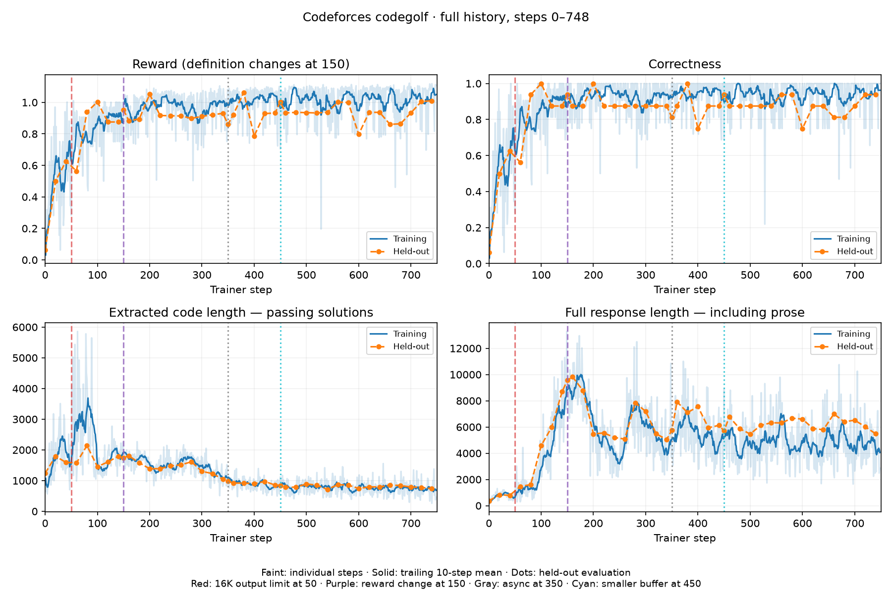
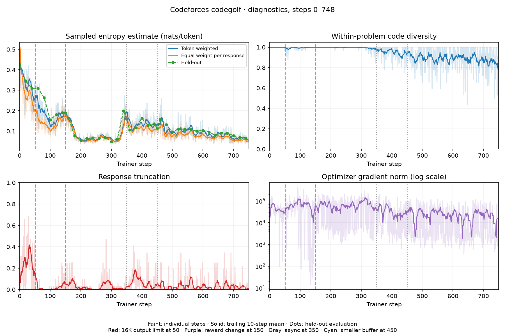
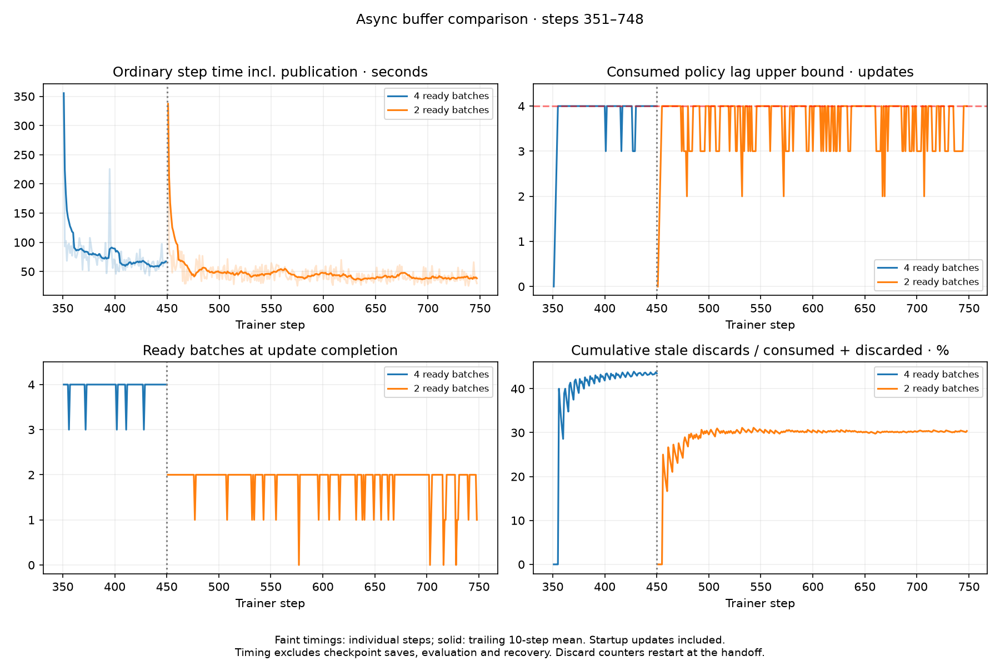

# Codeforces codegolf with Qwen3.5-9B

This example trains Qwen3.5-9B to write short, correct Python solutions. Each
update uses four Codeforces problems with eight sampled solutions per problem.
Modal sandboxes judge the solutions after generation; the model cannot run code
or revise an answer using test feedback.

GRPO is the default. Use `--variant tailrl` for
[Tail-Likelihood Reinforcement Learning](https://zanette-labs.github.io/TailRL-website/).
The dataset has 123 training problems and 16 held-out problems after reference
validation. See [setup](#setup-and-execution) to run the example and
[reward and configuration](#reward-and-configuration) for the training settings.

## Asynchronous execution

The default `prompt-v8` generates and judges rollouts while the trainer updates
weights. Four workers fill a queue of two ready batches, then continue producing
as the trainer consumes them one at a time. The run uses 4–8 inference replicas
and up to 64 concurrent judge sandboxes.

`async-v5` uses a four-batch queue. `reward-v4` selects the original synchronous
loop.

Each batch records the minimum requested weight version and the log probabilities
returned during sampling. Before an update, the trainer discards batches whose
recorded version is more than four updates old. The latest-policy sampler can
serve newer weights, so the recorded lag can overestimate the actual lag. PPO
uses the sampling log probabilities to compute importance ratios.

Recovery cancels the rollout workers and waits for them to finish, then clears
the queue before replacing the trainer.

Metrics record queue depth, in-flight and discarded batches, rollout time,
trainer wait time, update time, and publication time. Checkpoints, evaluation,
and insufficient sampling throughput can each leave the trainer waiting.

## Recorded results from the earlier shared deployment

Historical snapshot through **step 748**, from a run targeting **1,000** steps.
The validated split contains **123 training problems and 16 held-out problems**.







The last 20 recorded updates average 95.2% training correctness and 40 seconds
per ordinary step including weight publication. Held-out evaluation at 740 passes
15/16 problems, with passing code averaging 737 UTF-8 bytes. These timings exclude
checkpoint saves, evaluation, GPU allocation and recovery. They measure elapsed
time at the client.

The run is synchronous through step 350, uses async rollouts with a four-batch
ready queue at 351–450, then a two-batch queue from 451. Both async variants keep
four producers and enforce a maximum policy lag of four. At 748 the smaller-buffer
controller has trained on 298 batches and discarded 130 stale batches (30.4% of
consumed plus discarded batches), compared with 43.5% before the buffer change.
Pending work and discarded work from rolled-back attempts are excluded from
these percentages.

Step 0 is held-out evaluation only. The output limit increased to 16,384 at 50;
the reward changed at 150, so raw reward across that boundary is not comparable.
Recovery and planned handoffs restored checkpoints 350 and 450. The curves omit
updates discarded by those restores. Startup and handoff downtime are not
visible on the step axis. An early async attempt replayed steps 351–369 after a
restore; diagnostics select each metric's consumed sampling ticket so retained
files from the old attempt cannot create gaps or double-count samples.

The fixed evaluation has 16 stochastic samples, so one answer changes accuracy
by 6.25 percentage points. The average passing-code length also depends on which
problems were solved. Repeated exposure to the small training set and falling sampled entropy
leave a risk of overfitting. Code diversity is the exact-string distinct fraction
among eight submissions per problem, including incorrect submissions.

The [aggregate snapshot](figures/metrics.json) and [renderer](figures/render.py)
reproduce all three figures without prompts, hidden tests, credentials or raw
training rollouts:

```bash
uv run python figures/render.py
```

[Compare generated outputs at steps 150 and 620](figures/output-comparison.html):
three selected held-out problems, with both versions passing the retained tests.
Open the HTML in a browser to choose a problem and switch between the full
response and extracted Python code. These examples were selected to show shorter solutions.

## Reward and configuration

The default `prompt-v8` explicitly tells the model that solutions are judged on
correctness and source length, and asks it to omit comments and explanations.
It uses the stronger reward introduced in `async-v7`:

```text
penalty = 0.20 * min(output_tokens / 16384, 1)
reward  = 1 + 0.30 * exp(-code_utf8_bytes / 2048) - penalty  # all tests pass
reward  = -penalty                                        # otherwise
advantage = (reward - group_mean) / max(group_std, 0.5)
```

The historical step-748 snapshot uses `async-v6`, with bonus 0.15 and token
penalty 0.08. Its later `async-v7` continuation and the new `prompt-v8` run are
not included in those figures. Compare correctness and lengths across reward
changes.

All output tokens count toward the length penalty, including prose outside the
extracted code. Passing earns at least 0.80 and failing earns at most zero, so
correctness takes priority over length. The standard-deviation floor keeps tiny
length differences from becoming unit-sized updates. `reward-v3`
retains the previous `1 + 0.1 * exp(-bytes / 256)` passing reward without an
output penalty.

[Configuration](codegolf/config.py): 1,000 steps by default, 4×8 samples per step,
16,384 output tokens, temperature 1, Adam learning rate 1e-6, PPO clipping
[0.8, 1.2], full model + optimizer checkpoints every 50 steps and at completion,
held-out evaluation every 20. Prompt targets are masked and sampled solutions
have equal total loss weight. There is no KL penalty or entropy bonus. Entropy
plots estimate mean negative sampled-token log probability.

The recorded trainer was **8×H200, 65,536 context, TP2/CP2/DP2**. This example
uses Spindle's Qwen3.5-9B full-training definition in a scoped deployment.
Synchronous inference requests 1–2 replicas; async inference requests 4–8.

### Thinking variants

Both thinking variants enable Qwen's thinking mode and ask for a compact Python
program as the final answer. `thinking-v9` allows 16,384 generated tokens.
`thinking-v10` allows up to 65,536 minus the prompt length and one reserved token.
Thinking and final code share the output allowance.

Only code after `</think>` is judged. An unfinished thinking section counts as
no solution. Both thinking and answer tokens participate in the policy update
and count toward the output penalty, which reaches its cap of 0.20 at 16,384
tokens. `thinking-v10` uses the same reward as `thinking-v9`.

To start `thinking-v9` from base weights, use a new run name:

```bash
uv run --env-file .env codegolf launch --run golf-thinking --variant thinking-v9 --steps 1000
```

## TailRL extension

TailRL emphasizes rare high-reward solutions by integrating inverse tail counts
over the gaps between sorted rewards. This implementation follows
[the paper, version 2](https://arxiv.org/html/2609.02987v2) (Section 4, Appendices D
and G) and the released
[code-optimization estimator](https://github.com/Zanette-Labs/TailRL/blob/5682c6ac03387355e017ce966693266bb148fa10/experiments/code_optimization/code_opt/advantages.py).
The reference repository was reviewed at commit
`5682c6ac03387355e017ce966693266bb148fa10`.

For one problem's `N` rewards sorted in ascending order, with `r[0] = 0`:

```text
w[i] = sum((r[j] - r[j-1]) / (N-j+1) for j = 1..i)
A[i] = N * (w[i] - mean(w))
```

Advantages are restored to rollout order. The leading `N` follows the released
code-optimization convention for a loss averaged over samples; the website and
GUI implementation omit it. There is no standard-deviation normalization.
Ties share an advantage, and constant or singleton groups yield zero. Binary
rewards reduce to `N / successes - 1` for successes and `-1` for failures, with
all-zero advantages when there are no successes.

The example uses raw signed rewards. A common reward offset cancels after
centering; clipping failures to zero would discard the output-length penalty.
Reward units set the advantage scale, as described in Appendix D.

The `tailrl` variant uses the `async-v6` reward, eight training samples per problem,
and the same optimizer, PPO clipping, completion masks, equal sequence weighting,
and bounded asynchronous pipeline. It evaluates **eight samples per held-out
problem** by default. This is an adaptation to Spindle's PPO and length weighting;
the paper's on-policy guarantees do not directly establish behavior with stale
rollouts. The synchronous loop also supports `Config(advantage_estimator="tailrl")`.

After the setup below, redeploy the example to include the extension and launch:

```bash
uv run codegolf config --variant tailrl
uv run --env-file .env modal deploy -m codegolf.app
uv run --env-file .env codegolf launch --run golf-tailrl --variant tailrl --steps 500
uv run --env-file .env codegolf status --run golf-tailrl
uv run --env-file .env codegolf fetch --run golf-tailrl
uv run python -m codegolf.report runs/golf-tailrl
```

`--eval-samples N` overrides the held-out sample count in `config`, `launch`,
`fork_checkpoint.py`, and the Modal entry point. Use the same value for a GRPO
comparison, e.g. `--variant async-v6 --eval-samples 8`, and match the initialization,
dataset, seed, training budget and reward. Run comparisons sequentially when
sharing this single-controller deployment. Eight-sample evaluation generates
128 completions on the default 16 held-out problems, eight times the old evaluation
budget. Training still uses 32-rollout batches.

Each `eval/STEP.json` retains the original sample means and adds `eval_samples`,
`eval_problems`, `pass_at_k` and `best_of_k`. The latter maps use string keys for
budgets `1, 2, 4, ...` up to `N`, including `N` itself. Estimates average over all
size-`k` subsets within each problem, then average over problems. Pass@k uses judge
verdicts; Best-of-k uses the full correctness/brevity reward. Budgets above `N` are
never extrapolated. These measure selection with access to the judge.
`codegolf.report` writes `sampling.png` alongside `reward.png` and includes the
evaluation curves in `summary.json`.

Existing saved specs without the new fields resume as GRPO with one evaluation
sample. Estimator and evaluation-budget changes require a new run or checkpoint
fork so their metrics stay comparable. To continue an `async-v6` checkpoint with
TailRL, first stop and release the source controller as described below, then:

```bash
uv run --env-file .env python fork_checkpoint.py SOURCE_RUN golf-tailrl \
  --step 150 --steps 500 --variant tailrl
uv run --env-file .env codegolf launch --run golf-tailrl --steps 500 --variant tailrl
```

The committed source checkpoint must be exactly step 150 in this example. Forks
preserve model and optimizer state, record the source spec in `lineage.json`, and
evaluate the restored policy before the first update. When overriding
`--eval-samples`, pass the same value to the fork and launch commands.

## Setup and execution

The remote CPU controller creates a [scoped deployment](../../docs/scoped-runs.md)
with `spindle.run(...)` and the **8×H200,
TP2 × CP2 × DP2, 65,536-token** trainer recipe. Each sampler uses one H200.
The generated API URL/key stay in the controller process. Python 3.12 is required.
Configure Modal access, the `spindle-proxy` secret, and the existing `spindle-api`
secret containing your OTLP settings in the chosen environment.

On September 14, 2026, `qwen9b-prompt-v8` was launched in
`modal-labs / connor-dev-2`, using the `codegolf-scoped` app and volume. It starts
from base weights: the prior prompt-v8 attempt had no completed checkpoint.
The figures above come from the earlier shared deployment.

```bash
uv sync --frozen
cp .env.example .env
# Fill in your Modal profile/environment; this run generates its own API credentials.
# Configure Modal credentials separately. Never commit .env.
uv run codegolf config
uv run --env-file .env modal deploy -m codegolf.app
uv run python -m codegolf.data
uv run --env-file .env modal volume put spindle-codegolf-example data/problems.json /problems.json
uv run --env-file .env modal run -m codegolf.app --smoke
uv run --env-file .env modal run -m codegolf.app::judge_transport_smoke
uv run --env-file .env codegolf launch --run golf --steps 1000
```

Customize `CODEGOLF_APP` and
`CODEGOLF_VOLUME` for isolation, including the volume upload command above.
Run only one controller per deployment. The launch command saves its handle
locally and runs remotely after terminal disconnect. Smoke tests use CPU sandboxes;
training requires the GPU resources above.

```bash
uv run --env-file .env codegolf status --run golf
uv run --env-file .env codegolf fetch --run golf --rollouts
uv run python -m codegolf.report runs/golf
uv run python -m codegolf.diagnostics runs/golf
```

Omit `--rollouts` when plotting reward and correctness to avoid large downloads.
Include it for entropy and diversity plots, which need tokens and logprobs. Fetch removes stale metrics after
rollback. Dataset preparation pins `deepmind/code_contests` revision
`802411c3010cb00d1b05bad57ca77365a3c699d6`, selecting 160 Codeforces problems rated
800–1400 and retaining public, private, and generated tests. A problem is kept
only if its reference solution passes the sandbox judge. The remaining problems
are shuffled with the configured seed and split into training and evaluation
sets. Each run saves the dataset hash.

## Recovery and continuation

Sampling and judging retry transient failures with backoff. Before replacing a
client, the loop cancels pending workers and waits for them to finish. Judge
payloads are sent through stdin to avoid the 64 KiB command-line argument limit.
Sandboxes have timeouts and are terminated in `finally`.

If an optimizer request fails with an unknown outcome, the loop restores a
completed checkpoint instead of risking a duplicate update. It unloads the
model, creates a replacement, restores **model and optimizer**, and republishes
inference weights. It allows up to 30 recovery attempts. Modal can also retry
the CPU controller.

Run state is written atomically to a persistent Volume. The saved checkpoint
pointer changes only after a full save succeeds. On recovery, plots exclude
metrics from updates newer than that checkpoint.

Saving every 50 steps can lose 49 updates between checkpoints, or 50 if the next
save fails. Before the first checkpoint, recovery starts from base weights.
Check that updates resume after a restore: a live controller can still be stuck
waiting for GPUs or repeatedly failing.

Hard cancellation can skip Python cleanup. The API, trainer, and latest samplers
belong to the controller's ephemeral app and stop after Modal detects that the
owner disconnected. Verify container termination when stopping a run. This
example uses latest sampling only.

A controller retry opens a new scope and restores the saved checkpoint. Replacing
only the trainer keeps the existing scope.

The CLI refuses duplicate launches while its saved call is live, and refuses to
replace failed handles automatically. Inspect failures/checkpoints before archiving
a failed handle and resuming; preserve handles when moving machines. A completed
run can resume with a larger `--steps` target.

For a reward fork, stop and release the source controller's model resources, then:

```bash
uv run --env-file .env python fork_checkpoint.py SOURCE_RUN NEW_RUN --step 150 --variant async-v6
uv run --env-file .env codegolf launch --run NEW_RUN --variant async-v6
```

The helper requires the source's current committed checkpoint to match and rejects
an existing destination, changed dataset or changes outside reward, estimator,
evaluation-budget and pipeline settings. It records
`lineage.json`, preserves absolute step numbers, and evaluates the restored policy
before updating. Old reward metrics remain separate. Only fork runs created by
this example; private historical runs use a different configuration schema.

## Code and validation

[train.py](codegolf/train.py) is the loop/recovery;
[store.py](codegolf/store.py) persists state;
[reward.py](codegolf/reward.py) builds rewards and masked training data;
[evaluation.py](codegolf/evaluation.py) estimates held-out Pass@k and Best-of-k;
[judge.py](codegolf/judge.py) executes submissions. The other modules provide
configuration, dataset preparation, commands, and plots.

Submissions run without root access, network access, secrets, or mounted volumes.
The sandboxes limit CPU, memory, process count, output size, and execution time.
Expected outputs stay outside the sandbox. The judge compares hashes of
whitespace-separated output tokens. Custom checkers are unsupported. Public
problems may have appeared in the model's pretraining data.

```bash
uv run pytest -q
uv run ruff check codegolf tests fork_checkpoint.py figures/render.py
uv run ruff format --check codegolf tests fork_checkpoint.py figures/render.py
```

Tests cover judge transport/failures, reward bounds, loss masks, rollback,
uncertain optimizer/publication failures, continuation and cancellation/draining.
TailRL tests cover the released numerical example, binary MaxRL recovery, signed
rewards, ties, permutations, the finite-budget gradient identity, exhaustive
sampling-metric checks, and both synchronous and asynchronous checkpoint recovery.
The historical GRPO figures above were recorded before this cleaned example.

## Run observability

The controller passes its `OTEL_*` settings to the scoped services through
`telemetry_secret`. Spindle sends traces and metrics to the configured OTLP
destination; see the
[observability guide](../../docs/observability.md) for setup and field definitions.

Each model gets a run ID and an attempt ID. These labels connect controller
metrics to training and sampling traces, including retries. The controller
reports reward, correctness, passing code length, response length, sampled
entropy, queue statistics, checkpoints, and recovery events. OTLP payloads omit
prompts, generated code, logprob arrays, credentials, and other user metadata.

In Datadog, filter traces with `@spindle.run_id:RUN` and metrics with
`spindle.run_id:RUN`. Group traces by `spindle.run_attempt_id` to separate recovery
attempts. The deployment belongs to one experiment, so its trainer metrics also
carry the run ID. Group those metrics by `spindle.trainer_instance_id` to distinguish
trainer containers.

Trainer state is reported every five seconds for execution, checkpoint writing,
and sampler publication. Use `.fill(null)` in Datadog so missing reports appear
as gaps. Sampled entropy is mean negative sampled-token log probability.

Metrics already sent to Datadog remain visible after a checkpoint rollback,
so use the saved run files to determine which updates survived. The Datadog notebook
is created separately.

### Scoped-run validation

CPU-only Modal probes in `modal-labs/connor-dev-2` verified nested ownership and
normal scope exit. Killing the owner of a child with `min_containers=1` stopped
the child with zero containers approximately three minutes later (the heartbeat
timeout). A controller retry may therefore briefly overlap with resources from its
previous scope. A CPU-only check of the controller image also confirmed function
registration, the 8-H200/64K recipe, the 16K output budget, and initialization of
both OTLP exporters from the configured secret.

A real 8×H200 recovery probe then trained twice, saved full model/optimizer state,
and computed an uninterrupted third update as a reference. After forcibly killing
the trainer, a replacement restored the checkpoint: forward loss and deterministic
sample tokens matched exactly. Its third update succeeded, with gradient norm
within 0.0006% and post-update loss within 0.013% of the reference. Final sampling
succeeded and the scoped app stopped with zero containers. This validates the
core restore path.

Datadog showed training and sampling across both recovery attempts under one run
ID, including sampling HTTP retries. A separate exporter probe verified that
run-filtered physical trainer metrics reach Datadog after the scoped metric-tag
fix included in the imported observability implementation.
The [run notebook](https://app.datadoghq.com/notebook/15541726) uses the same run
filter across controller, trainer and sampler telemetry.
